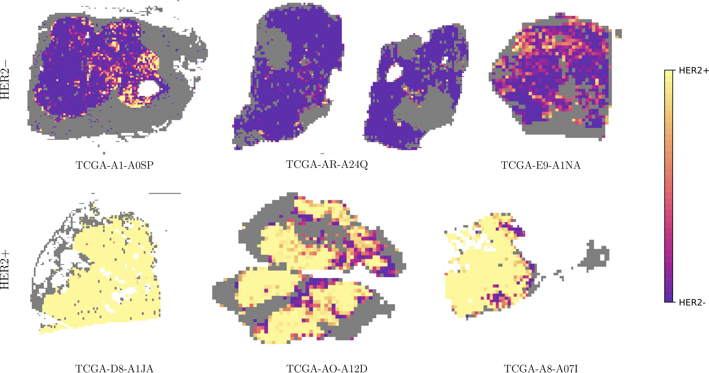

## Masters Thesis (MSc Applied Mathematics)

## Title: The Use of Deep Learning to Predict HER2 Status in Breast Cancer Directly from Histopathology Slides.

### Abstract
------------

The treatment of breast cancer is significantly influenced by the identification of various molecular biomarkers, including Human Epidermal Growth Factor Receptor 2 (HER2). Current techniques for determining HER2 status involve immunohistochemistry (IHC) and in-situ hybridization (ISH) methods. HER2 testing, which is routinely applied in cases of invasive breast cancer, serves as the primary biomarker guiding HER2-targeted therapies. H&E-stained whole slide images, which are more cost-effective, time-efficient, and routinely produced during pathological examinations, present an opportunity for leveraging deep learning to enhance the accuracy, speed, and affordability of HER2 status determination.

This thesis introduces a deep learning framework for predicting HER2 status directly from the morphological features observed in histopathological slides. The proposed system has two stages: initially, a deep learning model is employed to differentiate between benign and malignant tissues in whole slide images, using annotated regions of invasive tumors. Following this, the effectiveness of Inception-v4 and Inception-ResNet-v2 architectures in biomarker status prediction is explored, comparing their performance against previous model architectures utilized for this task, namely Inception-v3 and ResNet34. The study utilizes a dataset comprising whole slide images from 147 patients, sourced from the publicly available Cancer Genome Atlas (TCGA). Models are trained using 256 × 256 patches extracted from these slides. The best-performing model, Inception-v4, achieved an area under the receiver operating characteristic curve (AUC) of 0.849 (95% confidence interval (CI): 0.845 ≠ 0.853) per-tile and 0.767 (CI: 0.556 ≠ 0.955) per-slide in the test set.

This research demonstrates the capability of deep learning models to accurately predict HER2 status directly from histopathological whole slide images, offering a more cost- and time-efficient method for identifying clinical biomarkers, with the potential to inform and accelerate the selection of breast cancer treatments.


### Results and Conclusion
------------



The results shown here are based upon data generated and made publicly available by the [TCGA Research Network](http://cancergenome.nih.gov/).

This thesis presented a deep learning system for predicting HER2 status in breast cancer histopathology using whole slide images. A two-stage approach was employed: initially, a model to differentiate benign from malignant tissue was implemented, facilitating the generation of coarse segmentation maps of each slide for identifying cancerous regions. Subsequently, various models were trained and evaluated for their ability to determine HER2 status, in comparison with previous architectures employed in this domain. These models were assessed at both the patch and slide level, enhanced by visual analyses using prediction heatmaps.

Inception-v4 emerged as the most effective model, particularly at the slide level, while also demonstrating robust performance at the patch level. The results are promising, but further validation with independent data is necessary to confirm Inception-v4's improved performance in HER2 status prediction. Despite dataset differences making direct comparison with prior studies challenging, this research adds valuable insights to the field, particularly regarding the performance of Inception-v4 and Inception-ResNet-v2 in this specific application. The small dataset size used in the study presents a limitation, potentially contributing to the variability in model performance observed at the slide-level. This limitation highlights the need for larger datasets to validate and enhance the reliability of model performance.

In comparison with previous work, this study demonstrates that while Inception-v4 shows high precision, it is slightly behind Inception-v3, a popular previously implemented model, in terms of recall. This aspect is crucial in a clinical setting where high recall is vital to reduce the risk of missing diagnoses. The misclassifications observed at the slide level, potentially due to the variability in cancerous tissues exhibiting HER2 overexpression, highlight the complexities in HER2 status determination. When comparing models, the trade-offs between diagnostic errors must be considered, given the objective of determining a patient's HER2 status.

The results in this study contribute to and support previous work in the field, demonstrating the feasibility of deep learning systems for predicting molecular status directly from whole slide images. However, the need for external validation on larger, independent datasets is essential to confirm these results. These findings highlight the potential of deep learning to enhance diagnostic workflows in histopathology, assisting pathologists by contributing to more accurate, time- and cost-efficient methods for cancer biomarker identification, ultimately aiming to improve patient outcomes.

### Project Organization
------------

```plaintext
├── README.md          <- The top-level README for developers using this project.
├── data (saved locally)
│   ├── external       <- Data from third party sources.
│   ├── interim        <- Intermediate data that has been transformed.
│   ├── processed      <- The final data for modeling.
│   └── raw            <- The original data.
│
├── models             <- Trained models, model predictions, or model summaries (saved on server)
│
├── notebooks          <- Jupyter notebooks. Naming convention is a number (for ordering),
│                         the creator's initials, and a short `-` delimited description, e.g.
│                         `1.0-jqp-initial-data-exploration`.
│
├── reports            <- Generated analysis.
│   └── data figs      <- Figures generated from data exploration
│   └── exploration    <- Generated images for exploratory purposes, and to be used in thesis
│   └── results        <- Graphics and figures generated from model testing
│
├── requirements.txt   <- The requirements file for reproducing the analysis environment, e.g.
│                         generated with `pip freeze > requirements.txt`
│
├── src                <- Source code for use in this project.
│   ├── __init__.py    <- Makes src a Python module
│   │
│   ├── data           <- Scripts to generate and pre-process data
│   │   └── 
│   │
│   ├── models         <- Scripts to initialise, train and test models and and use trained models to make
│   │   │                 predictions
│   │   ├── predict_model.py
│   │   └── train_model.py
│   │
```

--------

<small>Project based on the [cookiecutter data science project template](https://drivendata.github.io/cookiecutter-data-science/)</small>

Read my full thesis [here](https://www.icloud.com/iclouddrive/05ez5dzMg95pkougBibqVgunA#FINAL_SUBMISSION)
